# Activity Diagram — Tracer Study UKDW

> Notasi UML Activity Diagram (Suriya Sundaramoorthy, 2022):
> `([●])` = Initial State | `([◎])` = Final State | `[ ]` = Action State | `{ }` = Decision Node | Swimlane = Subgraph

---

## UC-01 Login & Lupa Kata Sandi

**Aktor:** Semua pengguna | **Sistem**

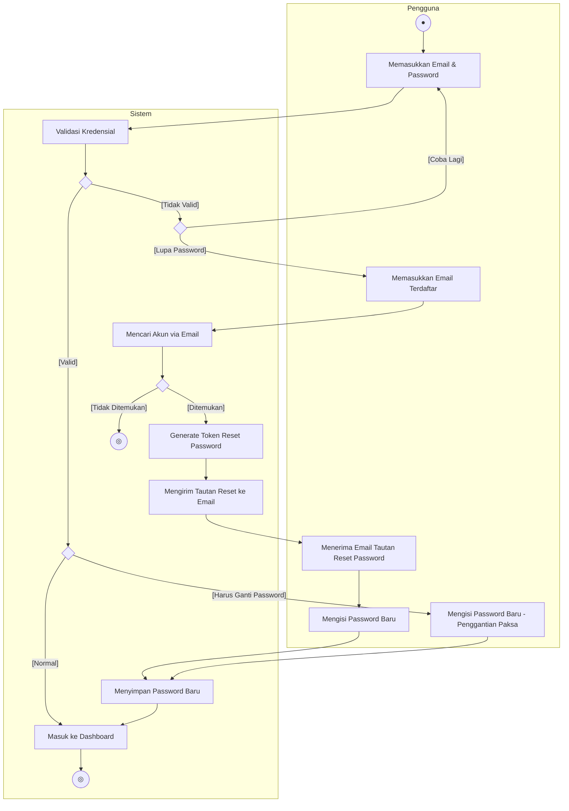
```mermaid
flowchart TD
  subgraph P["Pengguna"]
    A([●])
    B[Memasukkan Email & Password]
    F[Memasukkan Email Terdaftar]
    EM[Menerima Email Tautan Reset Password]
    H[Mengisi Password Baru]
    HC[Mengisi Password Baru - Penggantian Paksa]
  end
  subgraph S["Sistem"]
    C[Validasi Kredensial]
    D1{ }
    D2{ }
    D3{ }
    CE[Mencari Akun via Email]
    D4{ }
    GT[Generate Token Reset Password]
    KE[Mengirim Tautan Reset ke Email]
    SV[Menyimpan Password Baru]
    DB[Masuk ke Dashboard]
    ZZ([◎])
    ZE([◎])
  end
  A --> B --> C --> D1
  D1 -- "[Tidak Valid]" --> D2
  D2 -- "[Lupa Password]" --> F
  D2 -- "[Coba Lagi]" --> B
  D1 -- "[Valid]" --> D3
  D3 -- "[Harus Ganti Password]" --> HC
  D3 -- "[Normal]" --> DB
  F --> CE --> D4
  D4 -- "[Tidak Ditemukan]" --> ZE
  D4 -- "[Ditemukan]" --> GT --> KE --> EM --> H
  H --> SV
  HC --> SV
  SV --> DB --> ZZ
```

---

## UC-02 Mengisi Profil Alumni

**Aktor:** Alumni | **Sistem**

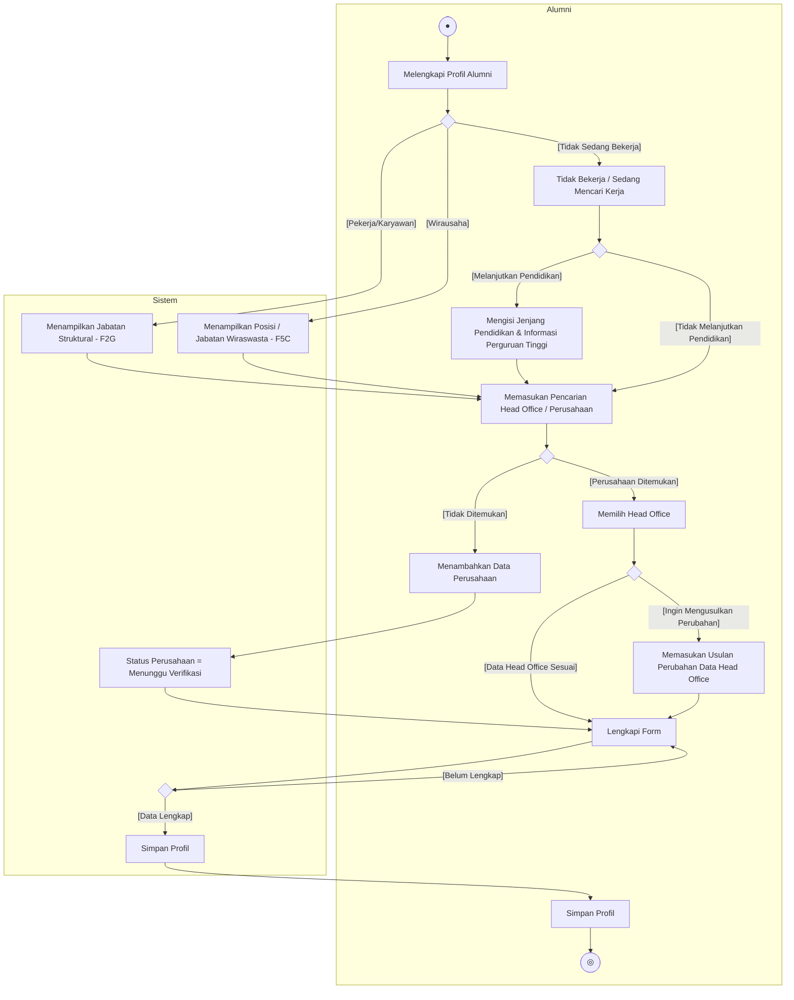
```mermaid
flowchart TD
  subgraph AL["Alumni"]
    A([●])
    B[Melengkapi Profil Alumni]
    D1{ }
    TB[Tidak Bekerja / Sedang Mencari Kerja]
    D2{ }
    PT[Mengisi Jenjang Pendidikan & Informasi Perguruan Tinggi]
    SC[Memasukan Pencarian Head Office / Perusahaan]
    D3{ }
    PH[Memilih Head Office]
    NP[Menambahkan Data Perusahaan]
    D4{ }
    UP[Memasukan Usulan Perubahan Data Head Office]
    LF[Lengkapi Form]
    SP[Simpan Profil]
    ZZ([◎])
  end
  subgraph S["Sistem"]
    FJ[Menampilkan Jabatan Struktural - F2G]
    FW[Menampilkan Posisi / Jabatan Wiraswasta - F5C]
    SV[Status Perusahaan = Menunggu Verifikasi]
    DL{ }
    SVP[Simpan Profil]
  end
  A --> B --> D1
  D1 -- "[Pekerja/Karyawan]" --> FJ --> SC
  D1 -- "[Wirausaha]" --> FW --> SC
  D1 -- "[Tidak Sedang Bekerja]" --> TB --> D2
  D2 -- "[Melanjutkan Pendidikan]" --> PT --> SC
  D2 -- "[Tidak Melanjutkan Pendidikan]" --> SC
  SC --> D3
  D3 -- "[Perusahaan Ditemukan]" --> PH --> D4
  D3 -- "[Tidak Ditemukan]" --> NP --> SV --> LF
  D4 -- "[Data Head Office Sesuai]" --> LF
  D4 -- "[Ingin Mengusulkan Perubahan]" --> UP --> LF
  LF --> DL
  DL -- "[Data Lengkap]" --> SVP --> SP --> ZZ
  DL -- "[Belum Lengkap]" --> LF
```

---

## UC-03 Mengisi Kuesioner Universitas

**Aktor:** Alumni | **Sistem**

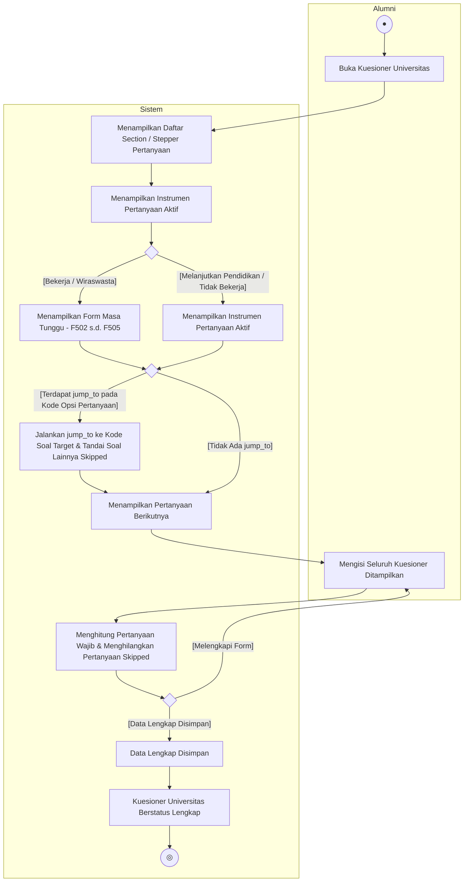
```mermaid
flowchart TD
  subgraph AL["Alumni"]
    A([●])
    BK[Buka Kuesioner Universitas]
    QS[Mengisi Seluruh Kuesioner Ditampilkan]
  end
  subgraph S["Sistem"]
    ST[Menampilkan Daftar Section / Stepper Pertanyaan]
    IP[Menampilkan Instrumen Pertanyaan Aktif]
    D1{ }
    MT[Menampilkan Form Masa Tunggu - F502 s.d. F505]
    IP2[Menampilkan Instrumen Pertanyaan Aktif]
    D2{ }
    JMP[Jalankan jump_to ke Kode Soal Target & Tandai Soal Lainnya Skipped]
    NXT[Menampilkan Pertanyaan Berikutnya]
    HIT[Menghitung Pertanyaan Wajib & Menghilangkan Pertanyaan Skipped]
    D3{ }
    SV[Data Lengkap Disimpan]
    LK[Kuesioner Universitas Berstatus Lengkap]
    ZZ([◎])
  end
  A --> BK --> ST --> IP --> D1
  D1 -- "[Bekerja / Wiraswasta]" --> MT
  D1 -- "[Melanjutkan Pendidikan / Tidak Bekerja]" --> IP2
  MT --> D2
  IP2 --> D2
  D2 -- "[Terdapat jump_to pada Kode Opsi Pertanyaan]" --> JMP --> NXT
  D2 -- "[Tidak Ada jump_to]" --> NXT
  NXT --> QS --> HIT --> D3
  D3 -- "[Melengkapi Form]" --> QS
  D3 -- "[Data Lengkap Disimpan]" --> SV --> LK --> ZZ
```

---

## UC-04 Mengisi Kuesioner Prodi

**Aktor:** Alumni | **Sistem**

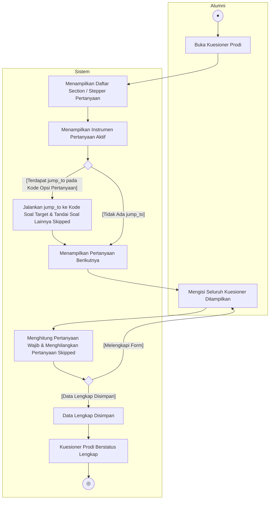
```mermaid
flowchart TD
  subgraph AL["Alumni"]
    A([●])
    BK[Buka Kuesioner Prodi]
    QS[Mengisi Seluruh Kuesioner Ditampilkan]
  end
  subgraph S["Sistem"]
    ST[Menampilkan Daftar Section / Stepper Pertanyaan]
    IP[Menampilkan Instrumen Pertanyaan Aktif]
    D1{ }
    JMP[Jalankan jump_to ke Kode Soal Target & Tandai Soal Lainnya Skipped]
    NXT[Menampilkan Pertanyaan Berikutnya]
    HIT[Menghitung Pertanyaan Wajib & Menghilangkan Pertanyaan Skipped]
    D2{ }
    SV[Data Lengkap Disimpan]
    LK[Kuesioner Prodi Berstatus Lengkap]
    ZZ([◎])
  end
  A --> BK --> ST --> IP --> D1
  D1 -- "[Terdapat jump_to pada Kode Opsi Pertanyaan]" --> JMP --> NXT
  D1 -- "[Tidak Ada jump_to]" --> NXT
  NXT --> QS --> HIT --> D2
  D2 -- "[Melengkapi Form]" --> QS
  D2 -- "[Data Lengkap Disimpan]" --> SV --> LK --> ZZ
```

---

## UC-05 Evaluasi Kinerja Alumni (Tanpa Login)

**Aktor:** Alumni | Pengguna Lulusan (Atasan) | **Sistem**

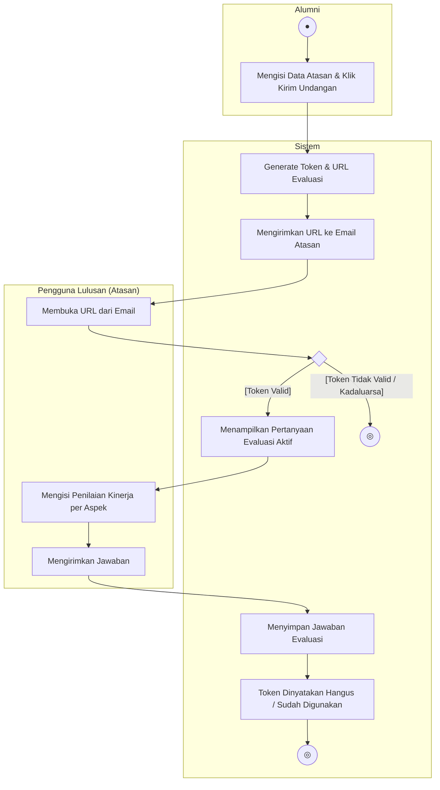
```mermaid
flowchart TD
  subgraph AL["Alumni"]
    A0([●])
    REQ[Mengisi Data Atasan & Klik Kirim Undangan]
  end
  subgraph S["Sistem"]
    GT[Generate Token & URL Evaluasi]
    KE[Mengirimkan URL ke Email Atasan]
    D1{ }
    TMP[Menampilkan Pertanyaan Evaluasi Aktif]
    SAV[Menyimpan Jawaban Evaluasi]
    TH[Token Dinyatakan Hangus / Sudah Digunakan]
    ZZ([◎])
    ZE([◎])
  end
  subgraph AT["Pengguna Lulusan (Atasan)"]
    OP[Membuka URL dari Email]
    ANS[Mengisi Penilaian Kinerja per Aspek]
    SEND[Mengirimkan Jawaban]
  end
  A0 --> REQ --> GT --> KE --> OP
  OP --> D1
  D1 -- "[Token Tidak Valid / Kadaluarsa]" --> ZE
  D1 -- "[Token Valid]" --> TMP --> ANS --> SEND --> SAV --> TH --> ZZ
```

---

## UC-06 Mengelola Data Alumni

**Aktor:** Admin | **Sistem**

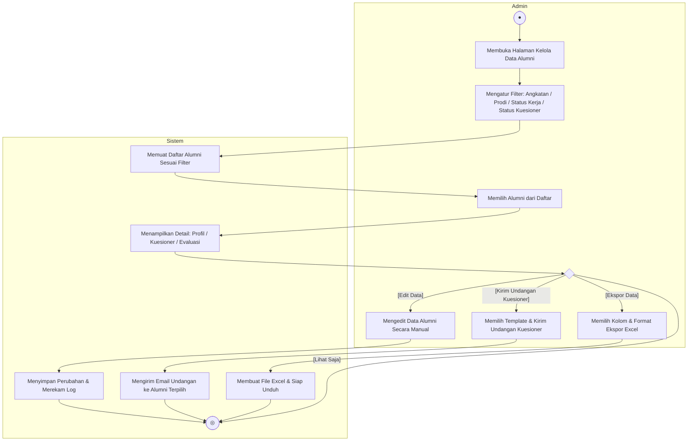
```mermaid
flowchart TD
  subgraph ADM["Admin"]
    A([●])
    B[Membuka Halaman Kelola Data Alumni]
    FL[Mengatur Filter: Angkatan / Prodi / Status Kerja / Status Kuesioner]
    SEL[Memilih Alumni dari Daftar]
    D1{ }
    ED[Mengedit Data Alumni Secara Manual]
    INV[Memilih Template & Kirim Undangan Kuesioner]
    EX[Memilih Kolom & Format Ekspor Excel]
  end
  subgraph S["Sistem"]
    C[Memuat Daftar Alumni Sesuai Filter]
    DET[Menampilkan Detail: Profil / Kuesioner / Evaluasi]
    SV[Menyimpan Perubahan & Merekam Log]
    SE[Mengirim Email Undangan ke Alumni Terpilih]
    GF[Membuat File Excel & Siap Unduh]
    ZZ([◎])
  end
  A --> B --> FL --> C --> SEL --> DET --> D1
  D1 -- "[Edit Data]" --> ED --> SV --> ZZ
  D1 -- "[Kirim Undangan Kuesioner]" --> INV --> SE --> ZZ
  D1 -- "[Ekspor Data]" --> EX --> GF --> ZZ
  D1 -- "[Lihat Saja]" --> ZZ
```

---

## UC-07 Verifikasi & Rekomendasi Perusahaan

**Aktor:** Admin | **Sistem**

> Alumni mengajukan perusahaan baru melalui halaman Profil. Algoritma matching dijalankan otomatis saat admin memilih pengajuan.

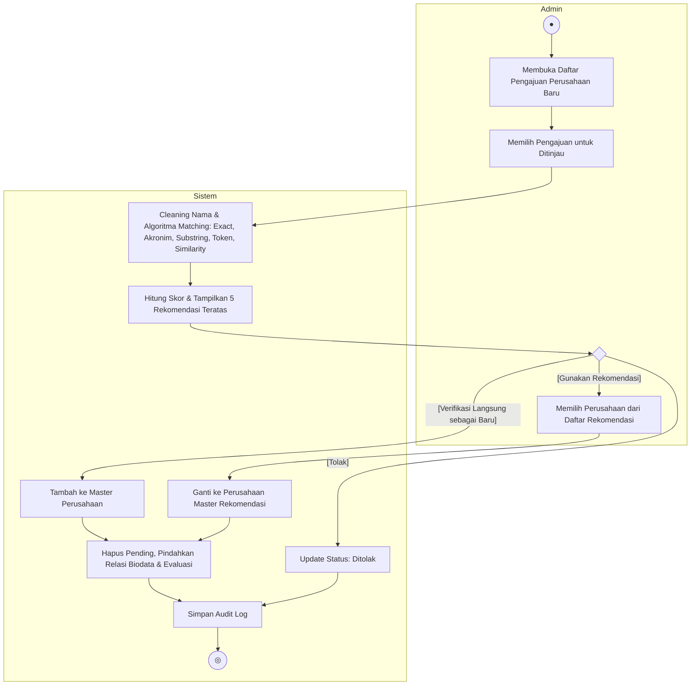
```mermaid
flowchart TD
  subgraph ADM["Admin"]
    A([●])
    B[Membuka Daftar Pengajuan Perusahaan Baru]
    SEL[Memilih Pengajuan untuk Ditinjau]
    DA{ }
    REC[Memilih Perusahaan dari Daftar Rekomendasi]
  end
  subgraph S["Sistem"]
    MATCH[Cleaning Nama & Algoritma Matching: Exact, Akronim, Substring, Token, Similarity]
    SC[Hitung Skor & Tampilkan 5 Rekomendasi Teratas]
    VA[Tambah ke Master Perusahaan]
    VB[Ganti ke Perusahaan Master Rekomendasi]
    VC[Update Status: Ditolak]
    PR[Hapus Pending, Pindahkan Relasi Biodata & Evaluasi]
    LOG[Simpan Audit Log]
    ZZ([◎])
  end
  A --> B --> SEL --> MATCH --> SC --> DA
  DA -- "[Verifikasi Langsung sebagai Baru]" --> VA --> PR --> LOG --> ZZ
  DA -- "[Gunakan Rekomendasi]" --> REC --> VB --> PR
  DA -- "[Tolak]" --> VC --> LOG
```

---

## UC-08 Sinkronisasi LinkedIn (Apify)

**Aktor:** Admin Prodi / Fakultas / Superadmin | **Sistem** | **Apify**

> Free tier Apify: maksimal 10 usage per sesi.

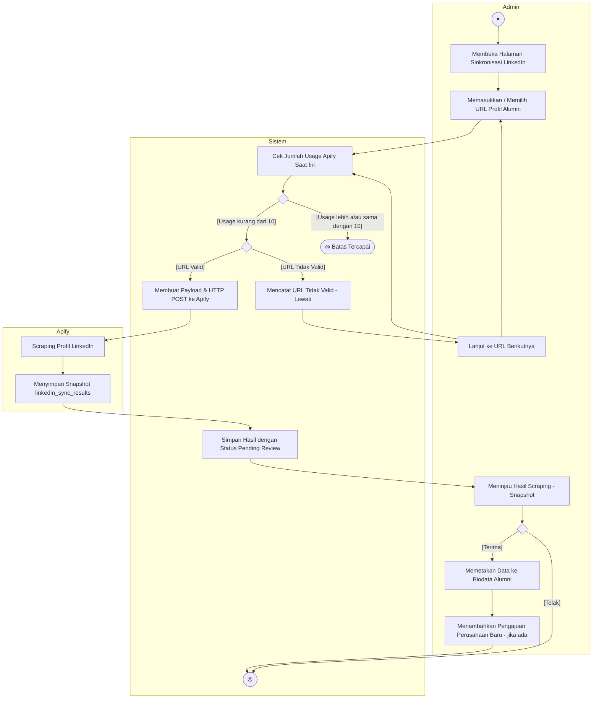
```mermaid
flowchart TD
  subgraph ADM["Admin"]
    A([●])
    B[Membuka Halaman Sinkronisasi LinkedIn]
    URL[Memasukkan / Memilih URL Profil Alumni]
    NEXT[Lanjut ke URL Berikutnya]
    REV[Meninjau Hasil Scraping - Snapshot]
    DA{ }
    MAP[Memetakan Data ke Biodata Alumni]
    PRO[Menambahkan Pengajuan Perusahaan Baru - jika ada]
  end
  subgraph S["Sistem"]
    CU[Cek Jumlah Usage Apify Saat Ini]
    D1{ }
    D2{ }
    PL[Membuat Payload & HTTP POST ke Apify]
    SN[Simpan Hasil dengan Status Pending Review]
    SKIP[Mencatat URL Tidak Valid - Lewati]
    ZL([◎ Batas Tercapai])
    ZZ([◎])
  end
  subgraph AP["Apify"]
    SCR[Scraping Profil LinkedIn]
    SNAP[Menyimpan Snapshot linkedin_sync_results]
  end
  A --> B --> URL --> CU --> D1
  D1 -- "[Usage lebih atau sama dengan 10]" --> ZL
  D1 -- "[Usage kurang dari 10]" --> D2
  D2 -- "[URL Tidak Valid]" --> SKIP --> NEXT --> URL
  D2 -- "[URL Valid]" --> PL --> SCR --> SNAP --> SN --> REV --> DA
  DA -- "[Terima]" --> MAP --> PRO --> ZZ
  DA -- "[Tolak]" --> ZZ
  NEXT --> CU
```

---

## UC-09 Mengelola Kuesioner Universitas

**Aktor:** Superadmin (ITC) | **Sistem**

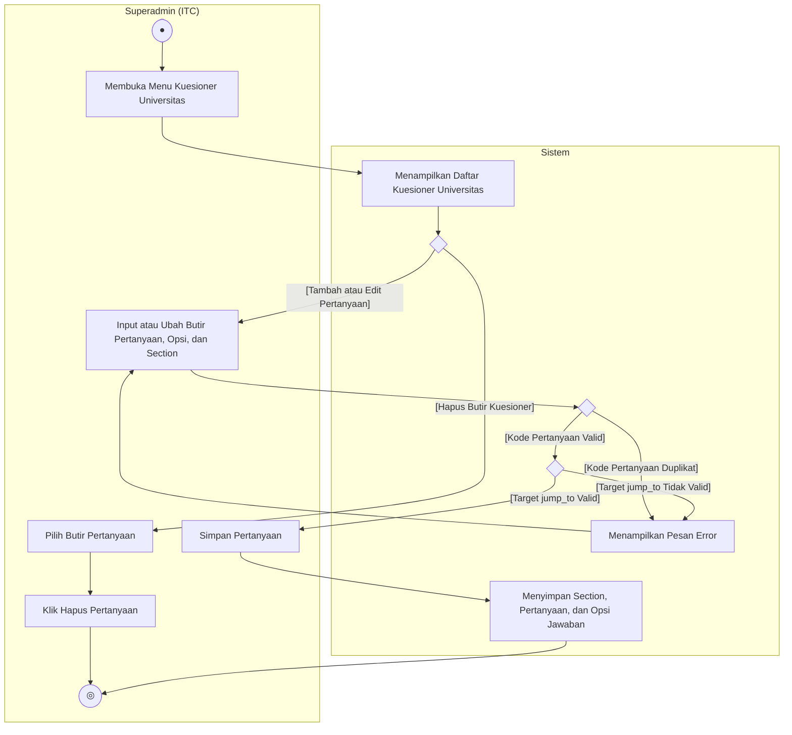
```mermaid
flowchart TD
  subgraph SA["Superadmin (ITC)"]
    A([●])
    B[Membuka Menu Kuesioner Universitas]
    PIL[Pilih Butir Pertanyaan]
    HPS[Klik Hapus Pertanyaan]
    EDT[Input atau Ubah Butir Pertanyaan, Opsi, dan Section]
    SMP[Simpan Pertanyaan]
    ZZ([◎])
  end
  subgraph S["Sistem"]
    C[Menampilkan Daftar Kuesioner Universitas]
    DK{ }
    D2{ }
    ERR[Menampilkan Pesan Error]
    D3{ }
    SV[Menyimpan Section, Pertanyaan, dan Opsi Jawaban]
  end
  A --> B --> C --> DK
  DK -- "[Hapus Butir Kuesioner]" --> PIL --> HPS --> ZZ
  DK -- "[Tambah atau Edit Pertanyaan]" --> EDT --> D2
  D2 -- "[Kode Pertanyaan Duplikat]" --> ERR --> EDT
  D2 -- "[Kode Pertanyaan Valid]" --> D3
  D3 -- "[Target jump_to Tidak Valid]" --> ERR
  D3 -- "[Target jump_to Valid]" --> SMP --> SV --> ZZ
```

---

## UC-10 Mengelola Kuesioner Prodi

**Aktor:** Superadmin / Admin Prodi | **Sistem**

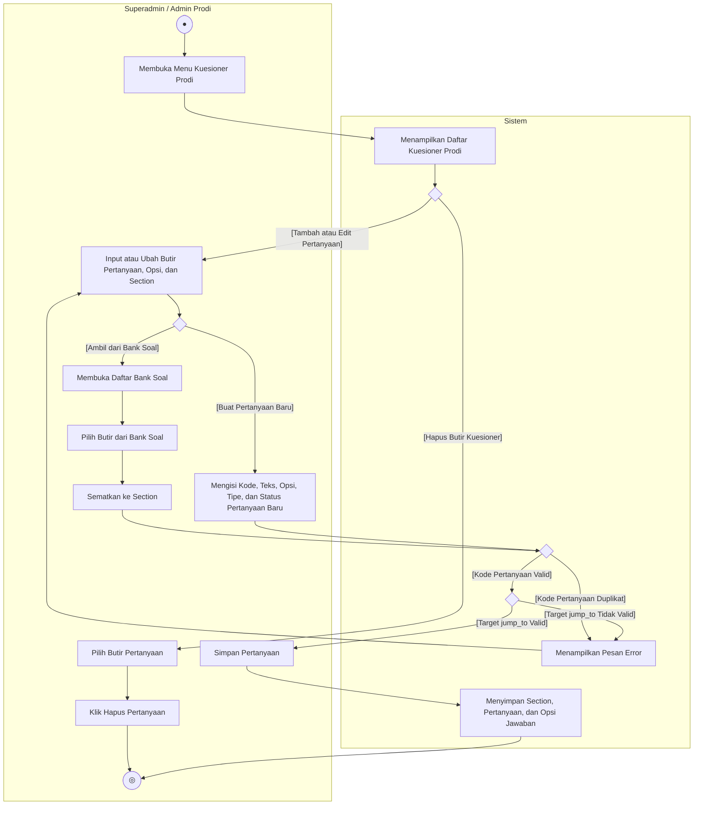
```mermaid
flowchart TD
  subgraph ADM["Superadmin / Admin Prodi"]
    A([●])
    B[Membuka Menu Kuesioner Prodi]
    PIL[Pilih Butir Pertanyaan]
    HPS[Klik Hapus Pertanyaan]
    EDT[Input atau Ubah Butir Pertanyaan, Opsi, dan Section]
    D1{ }
    BSK[Membuka Daftar Bank Soal]
    BPIL[Pilih Butir dari Bank Soal]
    BSE[Sematkan ke Section]
    BNEW[Mengisi Kode, Teks, Opsi, Tipe, dan Status Pertanyaan Baru]
    SMP[Simpan Pertanyaan]
    ZZ([◎])
  end
  subgraph S["Sistem"]
    C[Menampilkan Daftar Kuesioner Prodi]
    DK{ }
    D2{ }
    ERR[Menampilkan Pesan Error]
    D3{ }
    SV[Menyimpan Section, Pertanyaan, dan Opsi Jawaban]
  end
  A --> B --> C --> DK
  DK -- "[Hapus Butir Kuesioner]" --> PIL --> HPS --> ZZ
  DK -- "[Tambah atau Edit Pertanyaan]" --> EDT --> D1
  D1 -- "[Ambil dari Bank Soal]" --> BSK --> BPIL --> BSE --> D2
  D1 -- "[Buat Pertanyaan Baru]" --> BNEW --> D2
  D2 -- "[Kode Pertanyaan Duplikat]" --> ERR --> EDT
  D2 -- "[Kode Pertanyaan Valid]" --> D3
  D3 -- "[Target jump_to Tidak Valid]" --> ERR
  D3 -- "[Target jump_to Valid]" --> SMP --> SV --> ZZ
```

---

## UC-11 Mengelola Kuesioner Pengguna Lulusan

**Aktor:** Superadmin (ITC) | **Sistem**

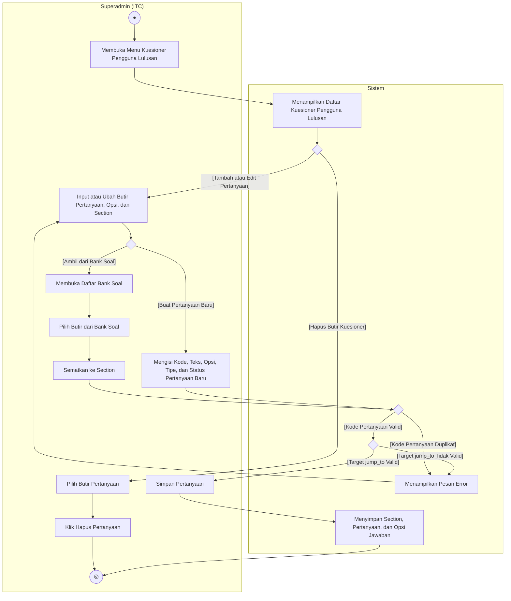
```mermaid
flowchart TD
  subgraph SA["Superadmin (ITC)"]
    A([●])
    B[Membuka Menu Kuesioner Pengguna Lulusan]
    PIL[Pilih Butir Pertanyaan]
    HPS[Klik Hapus Pertanyaan]
    EDT[Input atau Ubah Butir Pertanyaan, Opsi, dan Section]
    D1{ }
    BSK[Membuka Daftar Bank Soal]
    BPIL[Pilih Butir dari Bank Soal]
    BSE[Sematkan ke Section]
    BNEW[Mengisi Kode, Teks, Opsi, Tipe, dan Status Pertanyaan Baru]
    SMP[Simpan Pertanyaan]
    ZZ([◎])
  end
  subgraph S["Sistem"]
    C[Menampilkan Daftar Kuesioner Pengguna Lulusan]
    DK{ }
    D2{ }
    ERR[Menampilkan Pesan Error]
    D3{ }
    SV[Menyimpan Section, Pertanyaan, dan Opsi Jawaban]
  end
  A --> B --> C --> DK
  DK -- "[Hapus Butir Kuesioner]" --> PIL --> HPS --> ZZ
  DK -- "[Tambah atau Edit Pertanyaan]" --> EDT --> D1
  D1 -- "[Ambil dari Bank Soal]" --> BSK --> BPIL --> BSE --> D2
  D1 -- "[Buat Pertanyaan Baru]" --> BNEW --> D2
  D2 -- "[Kode Pertanyaan Duplikat]" --> ERR --> EDT
  D2 -- "[Kode Pertanyaan Valid]" --> D3
  D3 -- "[Target jump_to Tidak Valid]" --> ERR
  D3 -- "[Target jump_to Valid]" --> SMP --> SV --> ZZ
```

---

## UC-12 Melihat Laporan dan Analisis

**Aktor:** Admin / Admin Biro / Superadmin | **Sistem**

> Laporan perbandingan UMP dan sebaran wilayah membutuhkan master data UMP dan Wilayah yang sudah diisi oleh Superadmin.

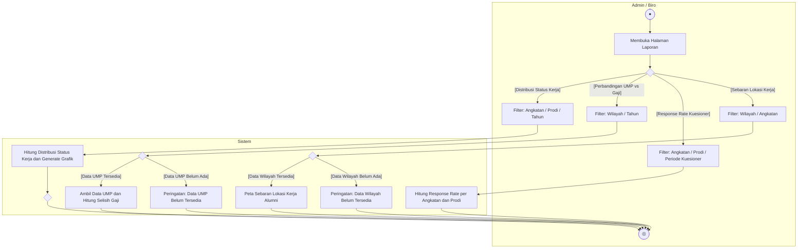
```mermaid
flowchart TD
  subgraph ADM["Admin / Biro"]
    A([●])
    B[Membuka Halaman Laporan]
    DA{ }
    F1[Filter: Angkatan / Prodi / Tahun]
    F2[Filter: Wilayah / Tahun]
    F3[Filter: Angkatan / Prodi / Periode Kuesioner]
    F4[Filter: Wilayah / Angkatan]
    ZZ([◎])
  end
  subgraph S["Sistem"]
    DB{ }
    DC{ }
    DD{ }
    G1[Hitung Distribusi Status Kerja dan Generate Grafik]
    G2[Ambil Data UMP dan Hitung Selisih Gaji]
    G2E[Peringatan: Data UMP Belum Tersedia]
    G3[Hitung Response Rate per Angkatan dan Prodi]
    G4[Peta Sebaran Lokasi Kerja Alumni]
    G4E[Peringatan: Data Wilayah Belum Tersedia]
  end
  A --> B --> DA
  DA -- "[Distribusi Status Kerja]" --> F1 --> G1 --> DB --> ZZ
  DA -- "[Perbandingan UMP vs Gaji]" --> F2 --> DC
  DC -- "[Data UMP Tersedia]" --> G2 --> ZZ
  DC -- "[Data UMP Belum Ada]" --> G2E --> ZZ
  DA -- "[Response Rate Kuesioner]" --> F3 --> G3 --> ZZ
  DA -- "[Sebaran Lokasi Kerja]" --> F4 --> DD
  DD -- "[Data Wilayah Tersedia]" --> G4 --> ZZ
  DD -- "[Data Wilayah Belum Ada]" --> G4E --> ZZ
```

---

## UC-13 Ekspor Data Alumni

**Aktor:** Admin / Admin Biro / Superadmin | **Sistem**

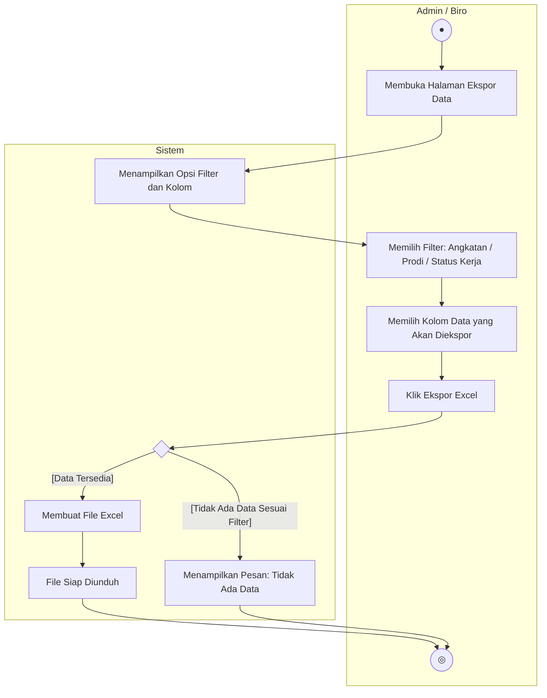
```mermaid
flowchart TD
  subgraph ADM["Admin / Biro"]
    A([●])
    B[Membuka Halaman Ekspor Data]
    FLT[Memilih Filter: Angkatan / Prodi / Status Kerja]
    PIL[Memilih Kolom Data yang Akan Diekspor]
    EX[Klik Ekspor Excel]
    ZZ([◎])
  end
  subgraph S["Sistem"]
    C[Menampilkan Opsi Filter dan Kolom]
    D1{ }
    GEN[Membuat File Excel]
    UND[File Siap Diunduh]
    ERR[Menampilkan Pesan: Tidak Ada Data]
  end
  A --> B --> C --> FLT --> PIL --> EX --> D1
  D1 -- "[Data Tersedia]" --> GEN --> UND --> ZZ
  D1 -- "[Tidak Ada Data Sesuai Filter]" --> ERR --> ZZ
```

---

## UC-14 Menghubungi Alumni

**Aktor:** Admin | **Sistem**

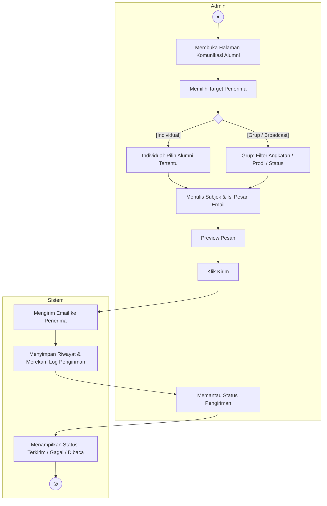
```mermaid
flowchart TD
  subgraph ADM["Admin"]
    A([●])
    B[Membuka Halaman Komunikasi Alumni]
    TRG[Memilih Target Penerima]
    DA{ }
    TI[Individual: Pilih Alumni Tertentu]
    TG[Grup: Filter Angkatan / Prodi / Status]
    MSG[Menulis Subjek & Isi Pesan Email]
    PRV[Preview Pesan]
    SND[Klik Kirim]
    STAT[Memantau Status Pengiriman]
  end
  subgraph S["Sistem"]
    SL[Menyimpan Riwayat & Merekam Log Pengiriman]
    SE[Mengirim Email ke Penerima]
    ST[Menampilkan Status: Terkirim / Gagal / Dibaca]
    ZZ([◎])
  end
  A --> B --> TRG --> DA
  DA -- "[Individual]" --> TI --> MSG
  DA -- "[Grup / Broadcast]" --> TG --> MSG
  MSG --> PRV --> SND --> SE --> SL --> STAT --> ST --> ZZ
```

---

## UC-15 Kelola Master UMP & Wilayah

**Aktor:** Superadmin (ITC) | **Sistem**

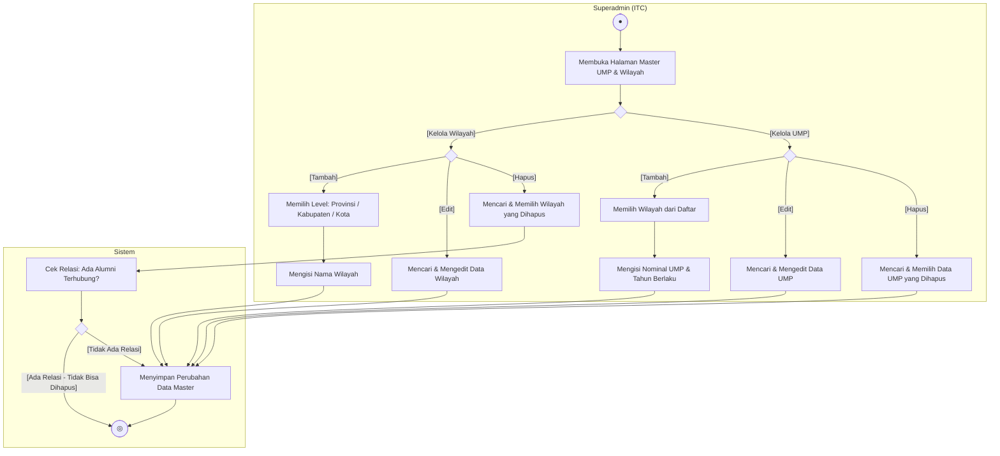
```mermaid
flowchart TD
  subgraph SA["Superadmin (ITC)"]
    A([●])
    B[Membuka Halaman Master UMP & Wilayah]
    DA{ }
    DB{ }
    W1[Memilih Level: Provinsi / Kabupaten / Kota]
    W2[Mengisi Nama Wilayah]
    WE[Mencari & Mengedit Data Wilayah]
    WD[Mencari & Memilih Wilayah yang Dihapus]
    DC{ }
    U1[Memilih Wilayah dari Daftar]
    U2[Mengisi Nominal UMP & Tahun Berlaku]
    UE[Mencari & Mengedit Data UMP]
    UD[Mencari & Memilih Data UMP yang Dihapus]
  end
  subgraph S["Sistem"]
    SV[Menyimpan Perubahan Data Master]
    CF[Cek Relasi: Ada Alumni Terhubung?]
    DE{ }
    ZZ([◎])
  end
  A --> B --> DA
  DA -- "[Kelola Wilayah]" --> DB
  DB -- "[Tambah]" --> W1 --> W2 --> SV --> ZZ
  DB -- "[Edit]" --> WE --> SV
  DB -- "[Hapus]" --> WD --> CF --> DE
  DE -- "[Ada Relasi - Tidak Bisa Dihapus]" --> ZZ
  DE -- "[Tidak Ada Relasi]" --> SV
  DA -- "[Kelola UMP]" --> DC
  DC -- "[Tambah]" --> U1 --> U2 --> SV
  DC -- "[Edit]" --> UE --> SV
  DC -- "[Hapus]" --> UD --> SV
```

---

## UC-16 Manajemen Akun Pengguna

**Aktor:** Superadmin (ITC) | **Sistem**

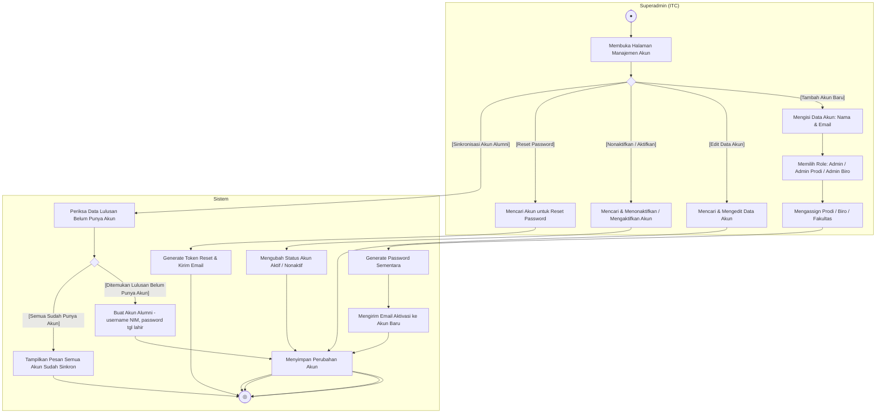
```mermaid
flowchart TD
  subgraph SA["Superadmin (ITC)"]
    A([●])
    B[Membuka Halaman Manajemen Akun]
    DA{ }
    N1[Mengisi Data Akun: Nama & Email]
    N2[Memilih Role: Admin / Admin Prodi / Admin Biro]
    N3[Mengassign Prodi / Biro / Fakultas]
    ED[Mencari & Mengedit Data Akun]
    DS[Mencari & Menonaktifkan / Mengaktifkan Akun]
    RS[Mencari Akun untuk Reset Password]
  end
  subgraph S["Sistem"]
    GP[Generate Password Sementara]
    KA[Mengirim Email Aktivasi ke Akun Baru]
    SV[Menyimpan Perubahan Akun]
    ST[Mengubah Status Akun Aktif / Nonaktif]
    GR[Generate Token Reset & Kirim Email]
    SY[Periksa Data Lulusan Belum Punya Akun]
    SD1{ }
    SAL[Buat Akun Alumni - username NIM, password tgl lahir]
    SNL[Tampilkan Pesan Semua Akun Sudah Sinkron]
    ZZ([◎])
  end
  A --> B --> DA
  DA -- "[Tambah Akun Baru]" --> N1 --> N2 --> N3 --> GP --> KA --> SV --> ZZ
  DA -- "[Edit Data Akun]" --> ED --> SV --> ZZ
  DA -- "[Nonaktifkan / Aktifkan]" --> DS --> ST --> SV --> ZZ
  DA -- "[Reset Password]" --> RS --> GR --> ZZ
  DA -- "[Sinkronisasi Akun Alumni]" --> SY --> SD1
  SD1 -- "[Ditemukan Lulusan Belum Punya Akun]" --> SAL --> SV --> ZZ
  SD1 -- "[Semua Sudah Punya Akun]" --> SNL --> ZZ
```

---

## UC-17 Mengelola Master Data Pengguna Lulusan

**Aktor:** Superadmin (ITC) | **Sistem**

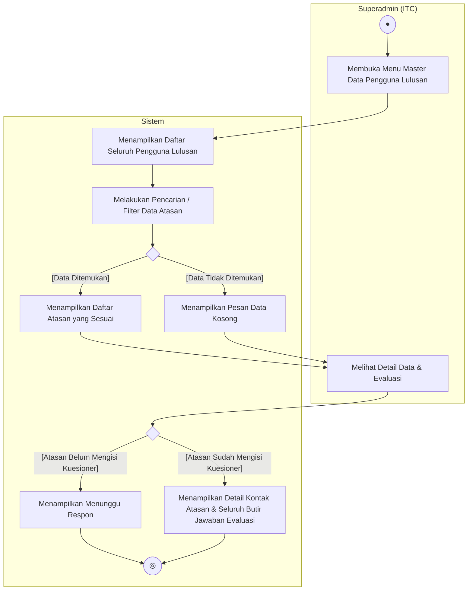
```mermaid
flowchart TD
  subgraph SA["Superadmin (ITC)"]
    A([●])
    B[Membuka Menu Master Data Pengguna Lulusan]
    DT[Melihat Detail Data & Evaluasi]
  end
  subgraph S["Sistem"]
    C[Menampilkan Daftar Seluruh Pengguna Lulusan]
    FL[Melakukan Pencarian / Filter Data Atasan]
    D1{ }
    DS[Menampilkan Daftar Atasan yang Sesuai]
    DE[Menampilkan Pesan Data Kosong]
    D2{ }
    MR[Menampilkan Menunggu Respon]
    DK[Menampilkan Detail Kontak Atasan & Seluruh Butir Jawaban Evaluasi]
    ZZ([◎])
  end
  A --> B --> C --> FL --> D1
  D1 -- "[Data Ditemukan]" --> DS
  D1 -- "[Data Tidak Ditemukan]" --> DE
  DS --> DT
  DE --> DT
  DT --> D2
  D2 -- "[Atasan Belum Mengisi Kuesioner]" --> MR --> ZZ
  D2 -- "[Atasan Sudah Mengisi Kuesioner]" --> DK --> ZZ
```

---

## UC-18 Log Aktivitas Sistem

**Aktor:** Superadmin (ITC) | **Sistem**

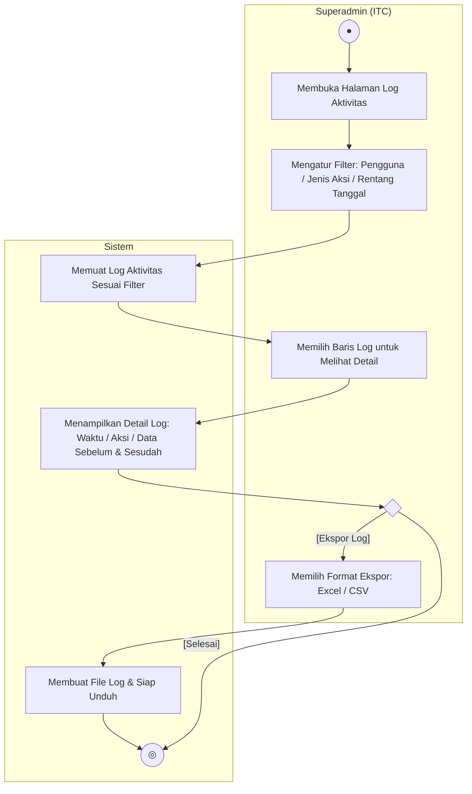
```mermaid
flowchart TD
  subgraph SA["Superadmin (ITC)"]
    A([●])
    B[Membuka Halaman Log Aktivitas]
    FL[Mengatur Filter: Pengguna / Jenis Aksi / Rentang Tanggal]
    SEL[Memilih Baris Log untuk Melihat Detail]
    DA{ }
    EX[Memilih Format Ekspor: Excel / CSV]
  end
  subgraph S["Sistem"]
    C[Memuat Log Aktivitas Sesuai Filter]
    DET[Menampilkan Detail Log: Waktu / Aksi / Data Sebelum & Sesudah]
    GF[Membuat File Log & Siap Unduh]
    ZZ([◎])
  end
  A --> B --> FL --> C --> SEL --> DET --> DA
  DA -- "[Ekspor Log]" --> EX --> GF --> ZZ
  DA -- "[Selesai]" --> ZZ
```
